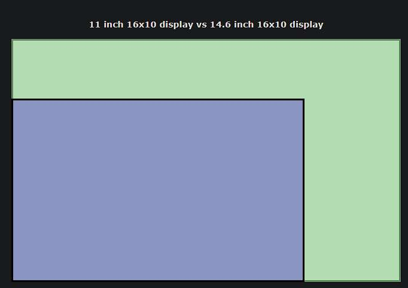

# Wymagania

- działa
- ma rysik
- ma wsparcie dla folii paper-like
- ma sporo miejsca
- nadaje się do czytania
# Wyjaśnienia

## Nadchodzące
- spekuluje się, że nowa wersja iPada Air wyjdzie w październiku lub następnej wiosny
## Specyfikacje
- im dawniej tablet został wypuszczony, tym mniej aktualizacji dostanie; u Apple problem mniej zauważalny, iPady są wspierane dłużej
- prawdopodobnie będziemy chcieli minimum 128 GB miejsca, może więcej; bardzo zależy, ile plików i w jaki sposób chcesz przechowywać
- wymagana ilość RAM-u w tabletach z Androidem będzie większa niż w iPadach; im większe pliki, tym większe wymagania; w tych pierwszych prawdopodobnie 6 GB i więcej
- brak opcji odblokowywania odciskiem palca / skanem twarzy może być bardzo uciążliwy, jeśli planujesz zabezpieczyć tablet hasłem, co raczej jest rekomendowane
- mAh: pojemność baterii; z reguły iOS ma lepsze życie na baterii na jednostkę
- w iPadach opcja miejsca na kartę SIM kosztuje około 1000 PLN więcej
- ceny nie zawierają klawiatury; jeśli takowej potrzebujesz, zintegrowana byłaby bardziej wygodna, osobne prawdopodobnie byłyby jakościowo lepsze i tańsze
- port USB-C do ładowania pozwolił by na posiadanie jednej ładowarki do telefonu i tabletu
- głośniki w iPadach są podobno cudowne
- przedstawione iPady mają refresh rate (jak często ekran się aktualizuje) 60 Hz, w porównaniu do 120+ w Androidach (choć to dość mało istotne do czytania)
- wszystkie ważą około 500g
## Ekran i rysik
- AMOLED & mini LED > OLED >> IPS
	- trzy pierwsze są zdecydowanie jaśniejsze, mają lepszy kontrast (czarne jest czarne, nie ciemnoszare)
- cale ("): przekątna ekranu
- nity: jasność ekranu
	- dla komfortowego korzystania na zewnątrz preferowanie 500 i wyżej
	- wartości to najwyższe, jakie mogą zostać osiągnięte przez ekran; jeśli ekran będzie wyświetlał coś białego całą powierzchnią, będzie ciemniej
- istnieją tańsze alternatywy dla Apple Pencil, aczkolwiek będą one zauważalnie gorsze
	- Apple Pencil 1st gen ładuje się przez wpięcie przewodu w rysik, nie przez przystawienie go do boku tabletu

ała
## Akcesoria
- szukanie akcesoriów do iPadów może być uciążliwe ze względu na dość beznadziejny naming scheme; jeśli nie widzisz wyników, warto zmienić nazwę w wyszukiwaniu
	- przykładowo iPad Air 2022 to również iPad Air 10.9 oraz iPad Air 5

# Format
## Nazwa | cena
link do zakupu
- folia paper-like
	- link
- release date
- ekran: przekątna, typ, jasność
- rysik
- odblokowywanie
- dysk / RAM, sd card slot
- wydajność / battery life
- Port do ładowania, moc (waty)
- Wodo- i pyłooporność
### adnotacje
- rzeczy warte uwagi
**rzeczy szczególnie pozytywne**, ==rzeczy szczególnie negatywne==
# iPad 9th gen / 10.2 | 3748 PLN
https://www.apple.com/pl/shop/buy-ipad/ipad-10-2/256gb-gwiezdna-szaro%C5%9B%C4%87-wifi
- dużo folii
	- https://allegro.pl/listing?string=folia+ochronna+paperlike+ipad+9
- Październik 2021
- 10.2", IPS, 500 nitów
- ==Apple Pencil 1st gen==
- Touch ID
- 256 GB / ==3 GB==, bez miejsca na kartę pamięci
- A13 Bionic / 8557 mAh
	- raczej good enough
- ==Port lightning, 20 W==?
- ==Nie jest oporny na wodę i pyły==
### adnotacje
- ból rysika 1st gen
- na górze i dole dużo niewykorzystanego miejsca

- port lightning – konieczność osobnego przewodu do ładowania
- lepsze opcje nie są o wiele droższe
- ilość RAM-u niepokoi – uciążliwe ograniczenie ilości i wielkości otwartych plików jest tutaj możliwe

# iPad 10th gen / 10.9 | 4553 PLN
https://www.apple.com/pl/shop/buy-ipad/ipad/256gb-srebrny-wifi
- dużo folii
	- https://allegro.pl/listing?string=folia+ochronna+paperlike+ipad+10
- Październik 2022
- 10.9", IPS, 500 nitów
- ==Apple Pencil 1st gen==
- Touch ID
- 256 GB / 4 GB, bez miejsca na kartę pamięci
- A14 Bionic / 7606 mAh
	- zdecydowanie good enough
- Port USB-C, 29 W?
- ==Nie jest oporny na wodę i pyły==
### adnotacje
- ta opcja zdaje się być warta dodatkowych ~800 PLN
- rysik 1st gen

# iPad Air 2022 / Air 5 / Air 10.9 | 5548 PLN
https://www.apple.com/pl/shop/buy-ipad/ipad-air/256gb-gwiezdna-szaro%C5%9B%C4%87-wifi
- dużo folii
	- https://allegro.pl/listing?string=folia+ochronna+paperlike+ipad+air+10.9
- Marzec 2022
- 10.9", IPS, 500 nitów
- **Apple Pencil 2nd gen**
- Touch ID
- 256 GB /  8 GB, bez miejsca na kartę pamięci
- **Apple M1**, 7600 mAh
	- uhuhu, overkill
- Port USB-C, 30 W?
- ==Nie jest oporny na wodę i pyły==
### adnotacje
- największe różnice dotyczą specyfikacji (co raaaczej jest tutaj mniej istotne) oraz nowszej wersji rysika
- zaobserwowano, że cegiełka do ładowania w pudełku (20 W) nie ładuje tabletu tak szybko, jak jest to możliwe (~30 W)

# Xiaomi Pad 6 | 2498 PLN
https://www.mi.com/pl/product/xiaomi-pad-6/?skupanel=1&gid=4223702080
- folie istnieją
	- https://allegro.pl/listing?string=folia+papier+xiaomi+pad+6
- Kwiecień 2023
- 11", IPS, 550 nitów
- Xiaomi Smart Pen 2nd gen
	- https://mi-home.pl/en/products/xiaomi-smart-pen-2nd-generation
- Face unlock
- 256 GB / 8 GB, bez miejsca na kartę pamięci
- Snapdragon 870, 8840 mAh
	- good enough
- Port USB-C, 33 W
- IP53 (oporność na ochlapanie wodą, kontakt z pyłem)
### adnotacje
- jakość korzystania z rysika może być nieco gorsza
- aktualizacje prawdopodobnie zakończą się wcześniej w porównaniu z powyższymi
- ==MIUI (nakładka systemowa) jest dość… polaryzujący==
	- ==występują też dziwne decyzje, typu nawigacja gestami jest dostępna tylko, gdy korzysta się z oficjalnego launchera==
- **144 Hz** refresh rate
- Xiaomi z jakiegoś powodu nieznaczne, lecz zauważalnie ogranicza szybkość ładowania z nieoficjalnych cegiełek
- ==system operacyjny out of the box może zawierać reklamy, trzeba by było nieco pobawić się w ustawieniach==
- prawdopodobnie gorsza jakość wykonania od pozostałych

# Xiaomi Pad 6 Pro | 2798 PLN
https://allegro.pl/oferta/xiaomi-mi-pad-6-pro-tablet-8g-256g-czarny-13817019075
	- nieoficjalny sprzedawca, prawdopodobnie import; aktualnie brak możliwości zakupu bezpośrednio od producenta w Polsce
- folie istnieją
	- https://allegro.pl/kategoria/akcesoria-gsm-folie-i-szkla-ochronne-10532?string=folia+paper+like+xiaomi+pad+6+pro&strategy=NO_FALLBACK
- Kwiecień 2023
- 11", IPS, 550 nitów
- Xiaomi Smart Pen 2nd gen
	- https://mi-home.pl/en/products/xiaomi-smart-pen-2nd-generation
- Face unlock?
- 256 GB / 8 GB, bez miejsca na kartę pamięci
	- za ~200 PLN więcej można powiększyć RAM do 12 GB, ale nie jest to konieczność
- **Snapdragon 8+ Gen 1**, 8600 mAh
	- zdecydowanie good enough
- Port USB-C, **67 W**
- Podobno wodo- i pyłooporny
### adnotacje
- ten model zdaje się być mniej popularny niż Pad 6
- patrz: Xiaomi Pad 6

# OnePlus Pad | 538.30 € (~2500 PLN)
https://www.oneplus.com/pl/checkout/payment?cartType=quick
(w konfiguracji: Pad + SUPERVOOC 65W + OnePlus Stylo)
- ==folia wymaga importu==
	- https://www.amazon.com/Supershieldz-Anti-Glare-Protector-Designed-OnePlus/dp/B0C3Y41NCB
- Luty 2023
- 11.61", IPS, 500 nitów
- OnePlus Stylo
- Face unlock
- ==128 GB== / 8 GB, bez miejsca na kartę pamięci
- **Mediatek Dimensity 9000**, 9510 mAh
	- zdecydowanie good enough
- Port USB-C, 67 W
- Brak oficjalnych danych co do wodo- i pyłooporności
### adnotacje
- **144 Hz**
- jeden kolor iiii design jest dość… interesujący
- 128 GB może być ograniczające
- ==OxygenOS (nakładka systemowa) podobno zachowuje się momentami dziwnie, jeśli w ogóle działa==
- będzie ładować się zauważalnie szybciej od powyższych (bez Pad 6 Pro)
- prawdopodobnie gorsza jakość wykonania od pozostałych

# Samsung Galaxy Pad S9 | 4699^ PLN
https://www.samsung.com/pl/tablets/galaxy-tab-s9/buy/
- folie istnieją
	- https://xgsm.pl/product-pol-242247-Folia-Paper-Feel-do-Samsung-Galaxy-Tab-S9-Ochronna-na-ekran.html
- Sierpień 2023
- 11", **AMOLED**, **750 nitów**
	- (!)
- **S Pen**, dołączony w zestawie
- Czytnik linii papilarnych, face unlock
- 256 GB / 12 GB, **możliwość rozszerzenia kartą pamięci (do +1TB)**
	- tutaj otwiera się możliwość rozważenia opcji 128 / 8 za 700 mniej (tylko dla S9) i dokupienia karty pamięci, ale eh
- Snapdragon 8 Gen 2, 8400 mAh
	- overkill
- Port USB-C, **45 W**
- **IP68** (wysoka oporność na pyły, możliwość zanurzenia w wodzie słodkiej na głębokości 2m przez 30 minut)
### adnotacje
- **^do tabletu, przynajmniej aktualnie, można dokupić Galaxy Watch 5 Pro, o wartości ponad 1500 PLN, za 1 PLN; teoretyczna możliwość odsprzedania w celu obniżenia kosztów**
- **bezkonkurencyjny ekran, 120 Hz**
- ==nie ma cegiełki do ładowania w pudełku==
	- jedno z poniższych oraz 3. (180 ~ 210 PLN):
	  https://www.x-kom.pl/p/683883-ladowarka-do-smartfonow-anker-nano-ii-gan-65w.html
	  lub
	  https://www.x-kom.pl/p/603419-ladowarka-do-smartfonow-silver-monkey-ladowarka-sieciowa-gan-65w-usb-c-pd-usb-a-qc-30.html
	  oraz (długość wedle preferencji)
	  https://www.x-kom.pl/p/732313-kabel-usb-silver-monkey-kabel-usb-c-30-100w-05-m.html
	- jeśli Twój laptop ma możliwość ładowania przez USB-C, opcja 100 W może być lepszym wyborem – jedna ładowarka do wszystkiego
- Samsung DeX: możliwość korzystania z tabletu w sposób podobny do laptopa
- prawdopodobnie dłuższe wsparcie aktualizacjami w porównaniu do reszty Androidów
- **Samsung ma jedną z lepszych nakładek Androida**
- **rysik porównywalny z Apple Pencil**
- w zasadzie najgorszą wadą są ograniczenia Androida w porównaniu z iPadOS, aczkolwiek tutaj to może nie być istotne
### S9+: +300 PLN
- ekran 12.4" (powierzchnia większa o 27%), 950 nitów
- bateria: 10090 mAh

### S9 Ultra: +1300 PLN
- ekran 14.6" (powierzchnia większa o 76%), 1750 nitów
- bateria: 11200 mAh

# Konkluzja
- Uniwersalny z najlepszym ekranem – Samsung Galaxy Pad 9 (lub odmiany)
- Największe możliwości – iPad Air 5
- Budżetowe good enough – Xiaomi Pad 6 (Pro)