# Tłumacz terminologii w Windows
https://msit.powerbi.com/view?r=eyJrIjoiODJmYjU4Y2YtM2M0ZC00YzYxLWE1YTktNzFjYmYxNTAxNjQ0IiwidCI6IjcyZjk4OGJmLTg2ZjEtNDFhZi05MWFiLTJkN2NkMDExZGI0NyIsImMiOjV9
# QoL
## Winget, Choco
Alternatywą `apt` na Windows jest `winget` oraz `choco` z GUI `WingetUI` – pozwala na automatyczną aktualizację programów.
	https://learn.microsoft.com/en-us/windows/package-manager/winget/
	https://chocolatey.org/install
	https://github.com/marticliment/WingetUI
## gsudo
Uprawnienia administratora dla dowolnego terminala.
`gsudo [komenda]`
	cmd jako admin: `winget install gsudo`
## FMHY
fmhy.pages.dev
# Zmiana edycji Windows z Home na Pro
- Powershell: `irm https://massgrave.dev/get | iex`
- Akceptacja uprawnień administratora
- 7
- 1
- 1
- Dalej za instrukcjami
- Reboot
# Instalacja
- Szukajka: Turn Windows features on or off
	- Włączenie (jeśli nie są włączone): Hyper-V, Virtual Machine Platform, Windows Subsystem for Linux
	- Reboot
- Opcjonalnie pobranie aplikacji Windows Terminal (ładnie integruje cmd, powershell i dystrybucje) z Microsoft Store
- Pobranie WSL oraz wybranej dystrybucji z terminala / MS Store
	- (admin) `wsl --install`
	- lista dostępnych: `wsl --list --online`
	- (admin) `wsl --install -d [nazwa distro]` 
- Uruchomienie distro poprzez szukajkę w start menu lub przez Windows Terminal
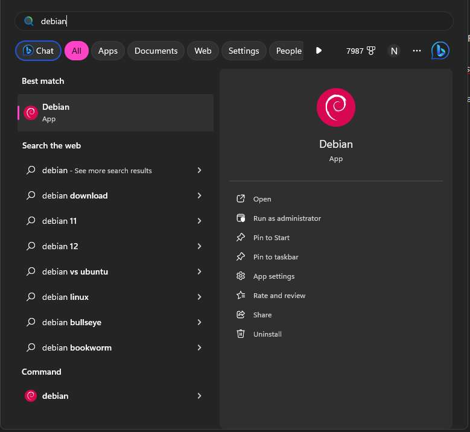
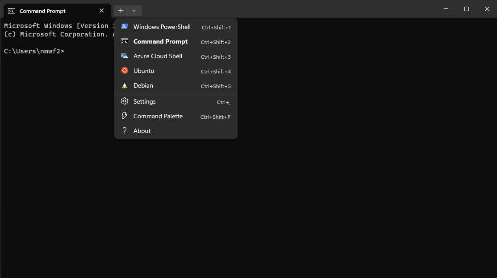
Windows Terminal
- Przy pierwszym uruchomieniu wprowadzenie dowolnej kombinacji nazwy Użytkownika oraz hasła
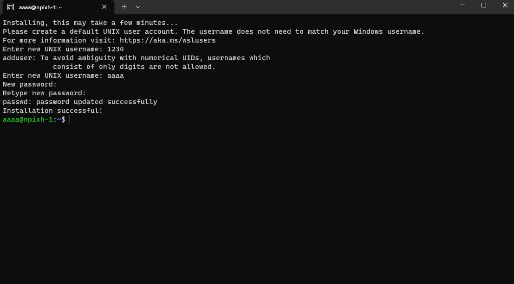
- aktualizacja; dla Debian i pochodnych:
	- `sudo apt update`
	- `sudo apt upgrade`
# Programy z GUI
https://learn.microsoft.com/en-us/windows/wsl/tutorials/gui-apps
- (jeśli nie zostało to wykonane wcześniej, co dość mało prawdopodobne) instalacja sterownika dla karty graficznej
	- dla AMD: https://www.amd.com/en/support
- instalacja programu
	- `sudo apt update`
	- `sudo apt install gimp -y`
- uruchomienie programu
	- `gimp`
# Dostęp do plików
https://askubuntu.com/questions/1380253/where-is-wsl-located-on-my-computer
## Pliki distro z Windows
- win + R
- `\\wsl$`
- Enter
## Pliki Windows z distro
Lista plików w danej lokalizacji:
- `ls /mnt/[folder path in Windows]`
	- przykładowo `"ls /mnt/c/program Files"`
	- ścieżki ze spacjami wymagają ""
# Troubleshooting
## Brak połączenia z siecią
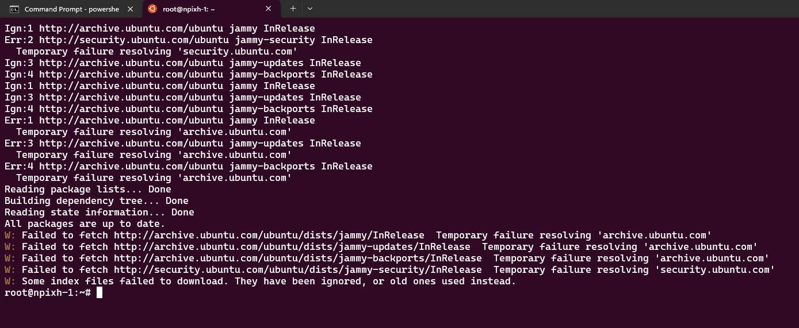
Z jakiegoś powodu Microsoft uznał, że adapter dla WSL będzie siecią publiczną, co może kreować szereg problemów.
### Reinstall
### Zezwolenie na połączenie przez Windows Firewall
- Szukajka: Allow an app through windows firewall
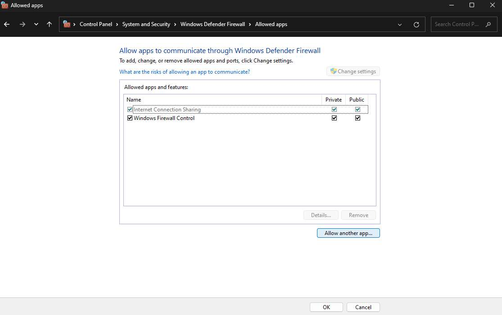
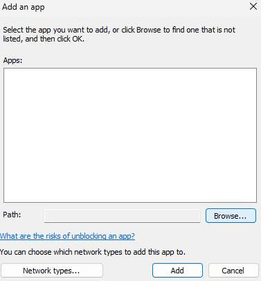
- Pliki
	- `C:\Windows\System32\wsl.exe`
	- `C:\Windows\System32\bash.exe`
	- `[distro name.exe]` oraz `wslservice.exe` w folderze `C:\Program Files\WindowsApps`
		- aby uzyskać dostęp:
			- win + R
			- `C:\Program Files\WindowsApps`
			- Enter
			- pojawi się komunikat o błędzie: przycisk Security
			- przy Owner będzie link z tarczą administratora, naciśnięcie i zaakceptowanie
				- będzie przy tym TrustedInstaller
			- Change przy Owner
			- Advanced
			- Find now
			- Administrators (w liczbie mnogiej)
			- OK
			- OK
			- Poczekanie na koniec procesu
			- Zamknięcie okna i otwarcie ponownie tak, jak za pierwszym razem
			- Double click na Administrators
			- Zaznaczenie wszystkich opcji (nie powinny być szare)
			- OK
			- Można wejść w folder
	- Network types: oba
	- Add x4
	- OK
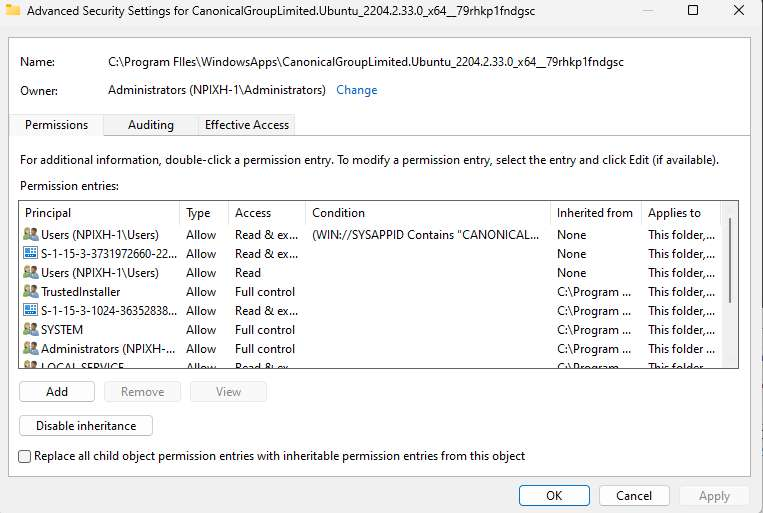
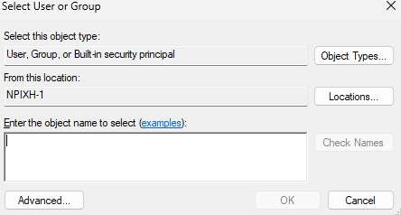
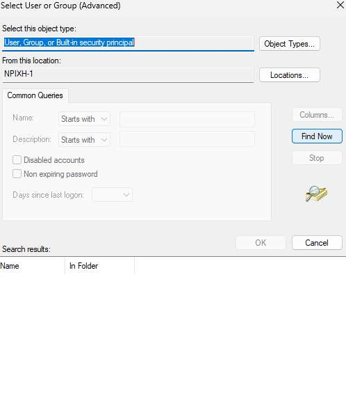
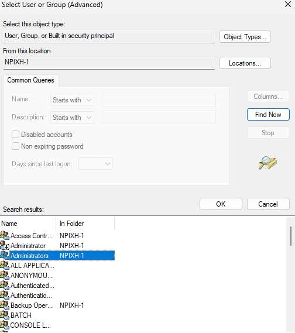
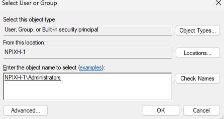
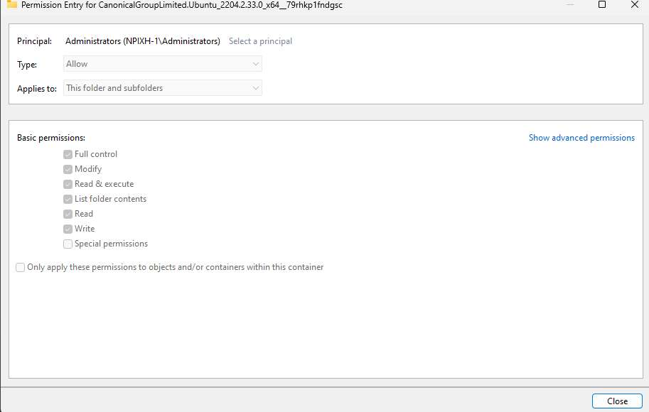
### Komenda
- powershell z uprawnieniami administratora
- `New-NetFirewallRule -DisplayName "WSL" -Direction Inbound  -InterfaceAlias "vEthernet (WSL)"  -Action Allow`
### Długi proces
https://github.com/luxzg/WSL2-fixes/blob/master/networkingMode%3Dbridged.md
### Wyłączenie firewall dla WSL
https://github.com/microsoft/WSL/issues/4139#issuecomment-1028835084
Windows będzie krzyczał
